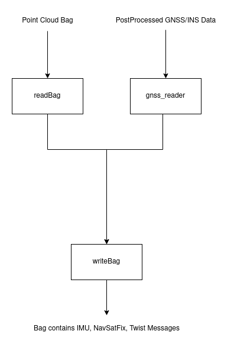

# txt2bag
Creates a bag contains messages pointcloud + imu + navsatfix + twistwithcovariance stamped from postprocessed GNSS/INS data and pointcloud bag.

## Design



## Usage
First thing should be done is changing config/params.yaml file. You should change the path to your bag file and the path to your postprocessed GNSS/INS data. Also you can change the topic names and frame ids.
### Parameters
To get accurate orientation of the vehicle, you should provide the starting orientation of the vehicle. You can get it from the postprocessed GNSS/INS data's first row. For example:

```
starting_orientation_roll: -0.777117
starting_orientation_pitch: -5.432728
starting_orientation_yaw: 219.101116
```

Other parameters can be changed according to your needs.

Then you should run the launch file:

```ros2 launch bagcreator txt2bag_launch.py```

When the bag's metadata is created, kill the node and you can run the bag file:

```ros2 bag play <bag_name>```

